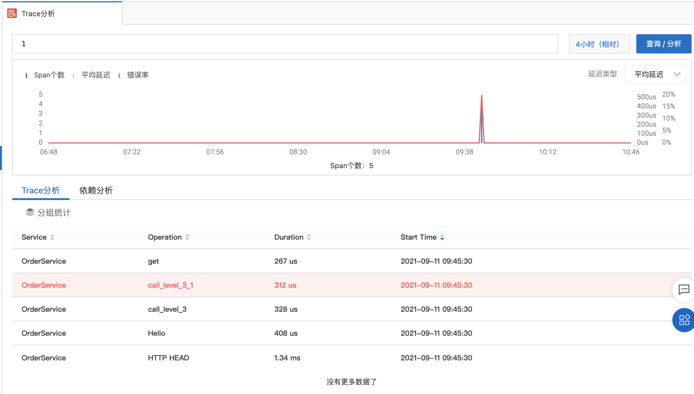
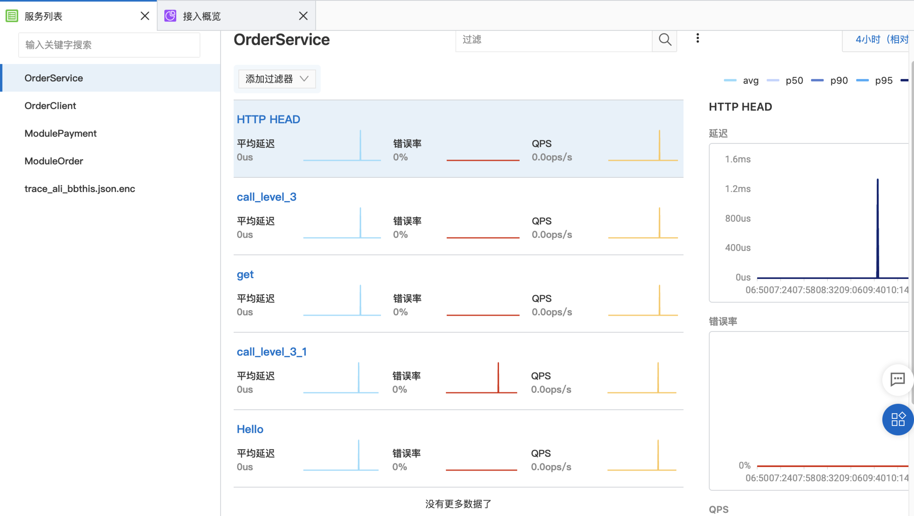
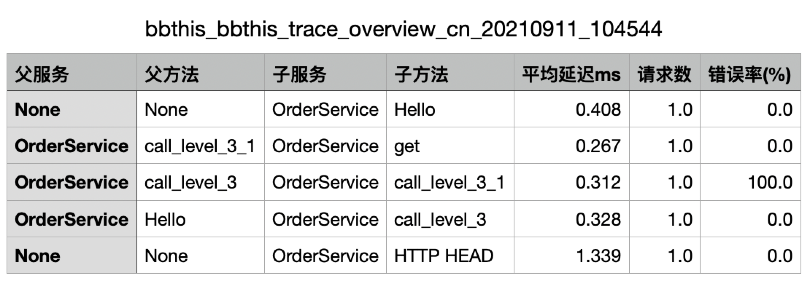

# 阿里云SLS日志服务接入DEMO
演示如何使用github.com/toniz/otel把Go程序的日志上传到Aliyun的SLS服务。

## 目录说明
* server HTTP服务编写举例
* client 客户端Go程序编写举例
* pack1 pack2 演示HTTP服务调用外部包如何传递调用关系。

## 使用
* 参考aliyun的SLS服务手册创建project和service.
* 填写server和client的trace_config.json文件。
* 编译和运行

## 结果演示：
调用结果在阿里云的SLS服务里面查看：
  
  
  

etc..

